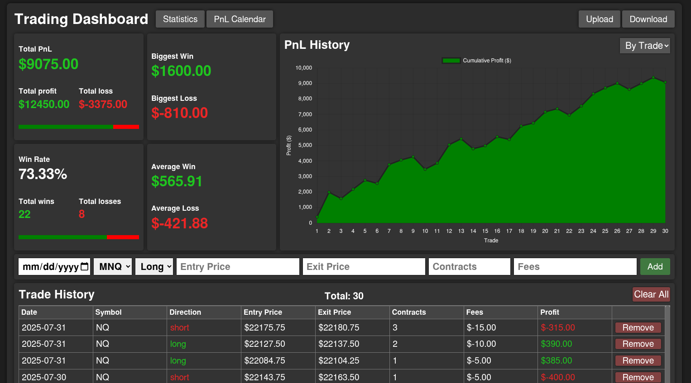
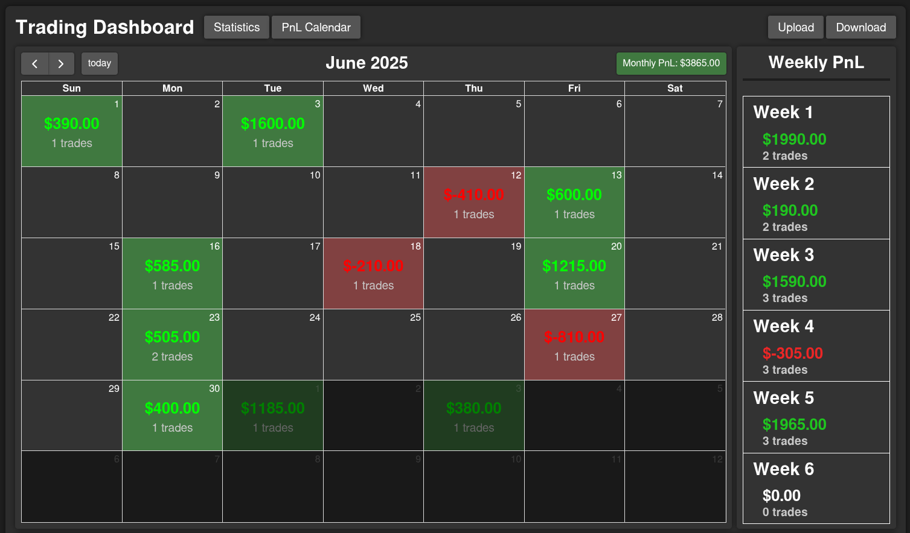

# Futures Trading Journal 📈

A sophisticated, client-side web application for futures traders to meticulously track their performance. This journal calculates advanced statistics, provides temporal analysis (daily, weekly, monthly), and offers full data portability via CSV files.

**Live Demo:** [https://jpatten04.github.io/trading-journal/](https://jpatten04.github.io/trading-journal/)

## Features

*   **Trade Management:**
    *   Log detailed trades: Instrument, Direction (Long/Short), Entry/Exit Price, Quantity, Date.
    *   Automatically sort all trades by date.
*   **Advanced Performance Analytics:**
    *   **Dashboard:** Real-time summary of Total PnL, Win Rate, Average Win/Loss, Largest Win/Loss, and Profit Factor.
    *   **Calendar View:** Filter and view aggregate PnL organized by Day, Week, and Month.
*   **Data Persistence & Portability:**
    *   **Export to CSV:** Download your entire trade history for backup or analysis in Excel/Google Sheets.
    *   **Import from CSV:** Bulk upload previous trades to populate your journal.

## Tech Stack & Concepts

*   **Frontend:** HTML, CSS, JavaScript
*   **UI:** DOM Manipulation, Dynamic HTML Generation, Event Handling
*   **Data Management:** Client-side Data Structures (Arrays, Objects), Array Methods (`map`, `filter`, `reduce` for calculations)
*   **Data Persistence:** `localStorage` API (to save trades between sessions)
*   **File Handling:** `FileReader` API (for CSV import), Programmatic CSV Generation & Download (for export)
*   **Styling:** Modern CSS (Flexbox, Grid, Custom Properties)
